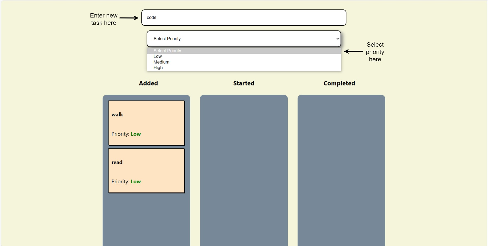
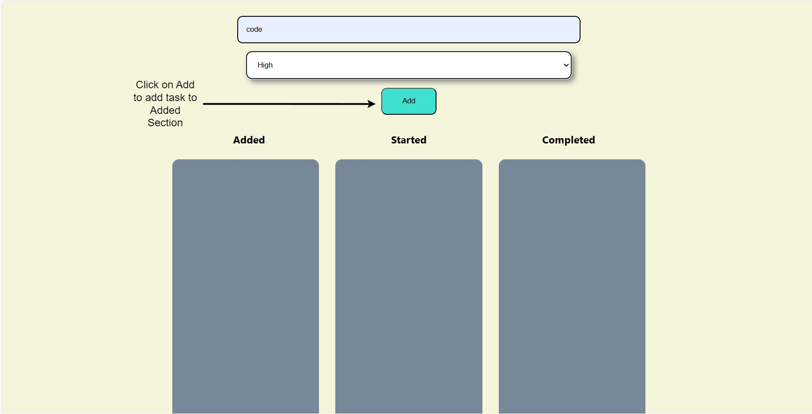
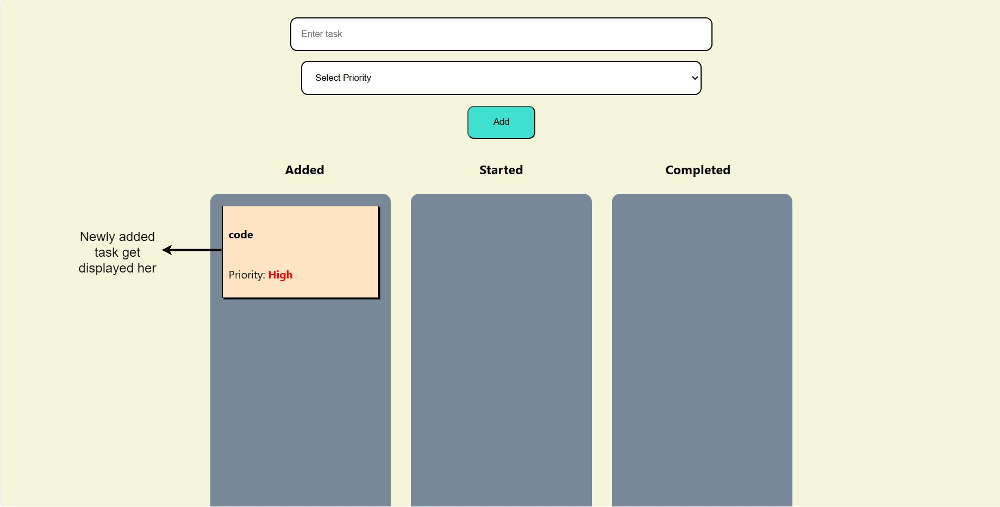
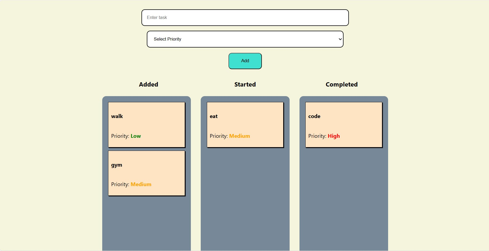

# Task Management tool

## This tool is used to manage tasks by arranging them by sorting between ADDED, STARTED and COMPLETED.

- Create task, set priority to task and then click on add button to add task.
- New task gets added in ADDED section.
- Tasks can be Dragged and Dropped onto STARTED and COMPLETED section depending upon status of task.

## Note

We are using React version 17 as we faced bugs using react-beautiful-dnd library (Drag and Drop library) with React 18.

## Available Scripts

In the project directory, you can run:

### `npm start`

Runs the app in the development mode.\
Open [http://localhost:3000](http://localhost:3000) to view it in your browser.

The page will reload when you make changes.\
You may also see any lint errors in the console.

### `npm run build`

Builds the app for production to the `build` folder.\
It correctly bundles React in production mode and optimizes the build for the best performance.

The build is minified and the filenames include the hashes.\
Your app is ready to be deployed.

## App Images

Working of app is shown on below images.

